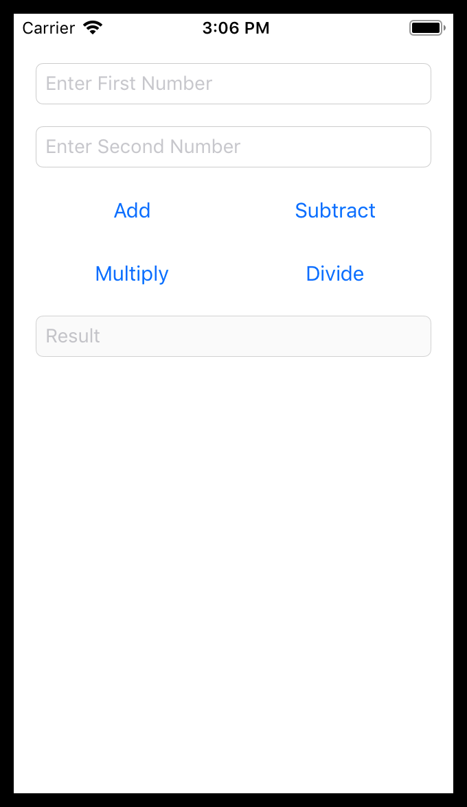

# AppDevClubProjects2019
iOS app development club projects for 2019 from meetings I taught / will teach.

## Individual Project Descriptions:

### SimpleCalculator (September 24)
**Xcode Version**: 10+

**Supported iOS Versions**: 10+

###### Concepts:
- Storyboard based UI
- Inroduction to constraints, outlets, and actions
- Optional types in swift and ways to handle them
- Conversions between data types

###### Screenshots:

