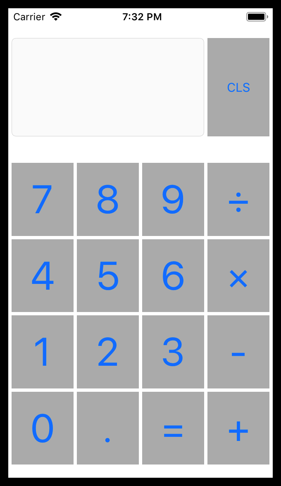

# AppDevClubProjects2019
iOS app development club projects for 2019 from meetings I taught / will teach.

## Xcode 11 notes
- When creating a project make sure to choose "Storyboard" for User Interface.
- To run on devices using iOS versions before iOS 13
  - Delete the `SceneDelegate.swift` file
  - Replace the contents of `AppDelegate.swift` with the contents of the [AppDelegatePreiOS13.swift](AppDelegatePreiOS13.swift) file in this repository.
  - Change the deploy target (under the project settings, select the project name at the top of the file explorer in the left panel)

## Individual Project Descriptions:

### Calculator (October 15)
**Xcode Version**: 10+

**Supported iOS Versions**: 10+

###### Concepts:
- More complex contraint layout
- Data type conversions (taking into account nil values)
- XCode 11 changes

###### Screenshots:

### SimpleCalculator (September 24)
**Xcode Version**: 10+

**Supported iOS Versions**: 10+

###### Concepts:
- Storyboard based UI
- Inroduction to constraints, outlets, and actions
- Optional types in swift and ways to handle them
- Conversions between data types

###### Screenshots:

